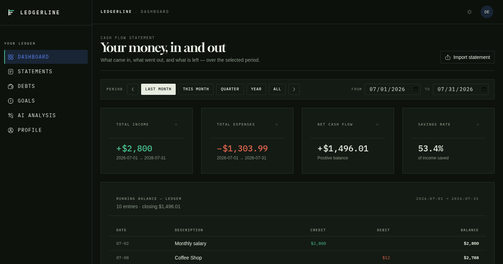
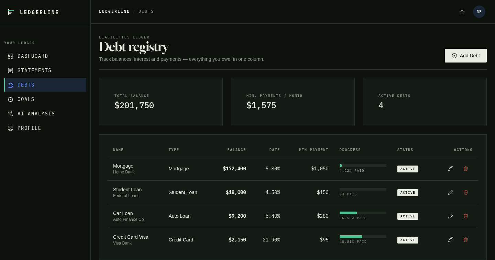
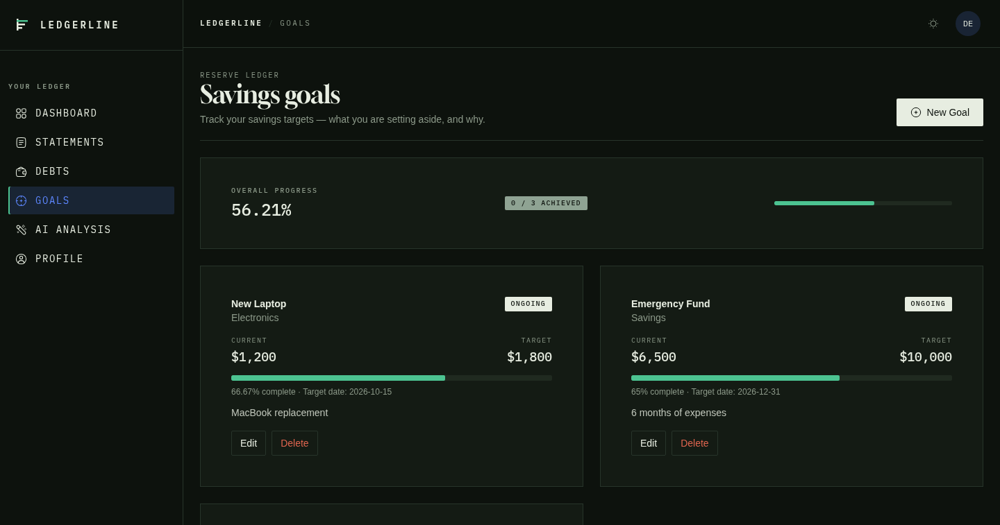
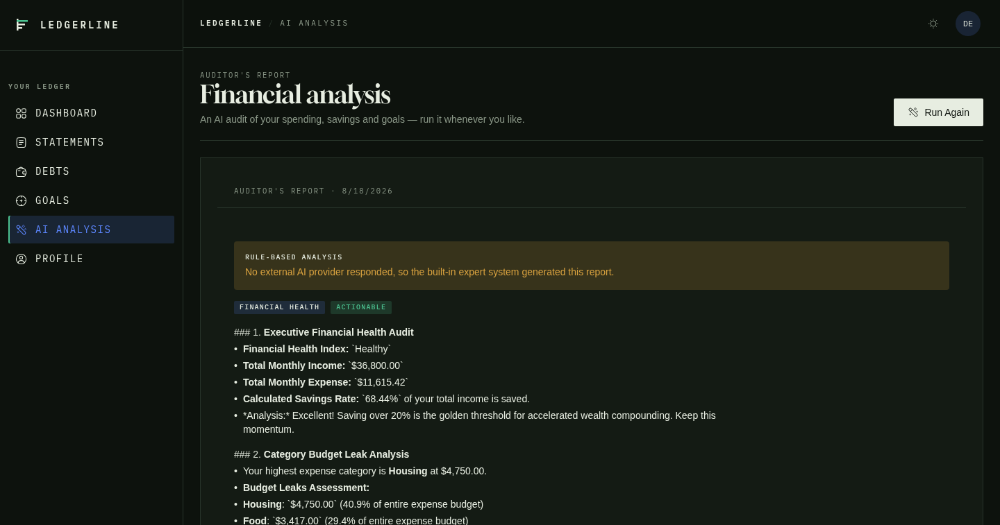
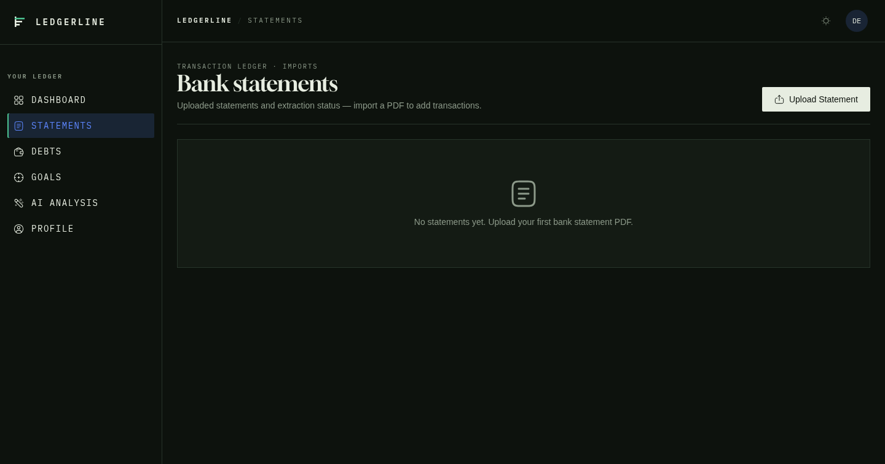
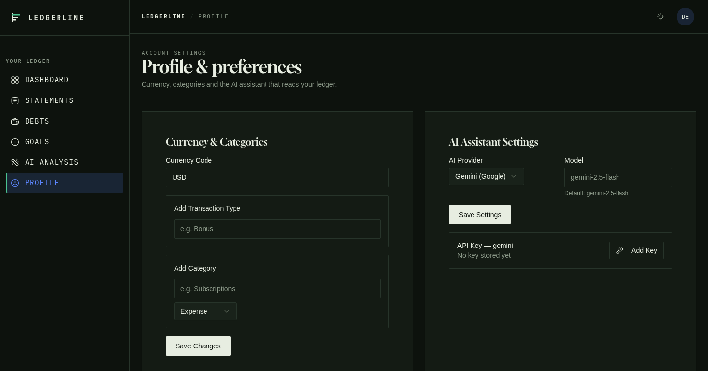
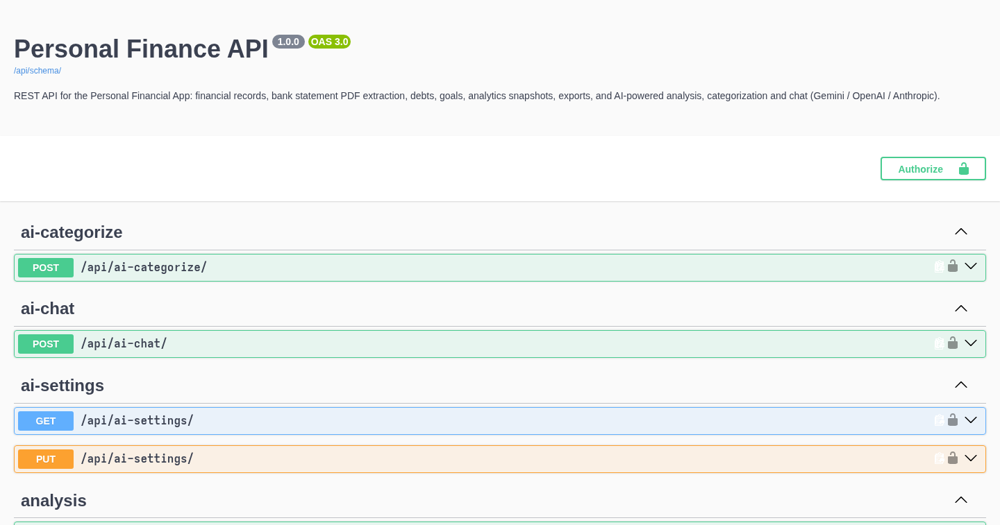

# Personal Financial App

A full-stack personal finance manager. Track income and expenses, upload bank statement PDFs for automatic extraction, manage debts and savings goals, and get AI-powered analysis and chat assistance.

- **Frontend:** React 19 + TypeScript + Vite + Tailwind CSS (shadcn-style UI)
- **Backend:** Django 6 + Django REST Framework + SimpleJWT (SQLite by default, MySQL supported)
- **AI:** Gemini, OpenAI, or Anthropic — bring your own API key, validated live and stored encrypted

```
┌─────────────────┐     HTTP / JSON (JWT)     ┌──────────────────┐
│  React frontend │ ────────────────────────▶ │ Django REST API  │
│  (Vite, :5173)  │                           │  (Django, :8000) │
└─────────────────┘                           └──────────────────┘
                                                       │
                                     PDF extraction (pdfplumber)
                                     AI provider calls (Gemini/OpenAI/Anthropic)
                                     SQLite / MySQL
```

## Demo

Screenshots from a live run against seeded demo data (dashboard, debts, goals, AI analysis, statement list, profile and the auto-generated Swagger UI).

### Dashboard

Financial health at a glance: stat tiles, income vs expenses charts, savings rate, health ratios and a debt summary. Period filters drive everything (month, quarter, year, custom range).



### Debts & Goals

A registry of everything you owe with payoff progress, monthly interest and payoff horizon; savings goals with target dates and per-goal progress.




### AI Analysis

Click **Start Analysis** and the backend produces an executive health audit, budget leak analysis and actionable steps — via Gemini/OpenAI/Anthropic, falling back to a rule-based expert system when no key is configured.



### Bank Statement Review

Uploaded PDFs land in a review queue with AI-suggested categories per transaction, bulk confirm and a chat assistant that understands the statement.



### Profile & Swagger UI

Customize currency, transaction types and categories, or manage AI provider keys. The REST API ships a live OpenAPI/Swagger UI at `/api/schema/swagger-ui/` (dev mode).




## Table of Contents

- [Demo](#demo)
- [Features](#features)
- [Tech Stack](#tech-stack)
- [Prerequisites](#prerequisites)
- [Getting Started](#getting-started)
  - [1. Backend setup](#1-backend-setup)
  - [2. Frontend setup](#2-frontend-setup)
  - [3. Run the app](#3-run-the-app)
- [API Documentation (Swagger)](#api-documentation-swagger)
- [AI API Keys (Sign Up)](#ai-api-keys-sign-up)
  - [Getting a key from a provider](#getting-a-key-from-a-provider)
  - [Adding the key in the app](#adding-the-key-in-the-app)
- [Using the App — Section by Section](#using-the-app--section-by-section)
  - [Dashboard](#dashboard)
  - [Bank Statements](#bank-statements)
  - [Debts](#debts)
  - [Goals](#goals)
  - [AI Analysis](#ai-analysis)
  - [Profile & AI Settings](#profile--ai-settings)
- [Project Layout](#project-layout)
- [Troubleshooting](#troubleshooting)
- [Further Reading](#further-reading)

## Features

- **Dashboard** with income/expense charts, savings rate, financial health ratios (liquidity, profitability, solvency), and debt summary
- **Bank statement import** — drag & drop PDFs, optional password for encrypted PDFs, automatic extraction of transactions, deduplication by content hash
- **Transaction review** — AI-suggested categories, bulk confirm, and a chat assistant that can answer questions about your transactions
- **Debt registry** with payoff progress, monthly interest, and payoff strategy
- **Savings goals** with progress tracking and analysis
- **AI financial analysis** — executive health audit, budget leak analysis, actionable steps
- **Customization** — currency code, custom transaction types and categories
- **JWT auth** with silent token refresh, CSV/PDF export

## Tech Stack

| Layer    | Technology |
|----------|------------|
| Frontend | React 19, TypeScript, Vite 8, Tailwind CSS 4, shadcn/ui components, Recharts/ApexCharts |
| Backend  | Python 3.14, Django 6.0, Django REST Framework, SimpleJWT, pdfplumber, reportlab |
| Storage  | SQLite (default) or MySQL, media files for uploaded PDFs |
| AI       | Gemini, OpenAI, Anthropic (live key validation, Fernet encryption at rest) |

## Prerequisites

- Python 3.12+ (project developed on 3.14)
- Node.js 20+
- A browser and an internet connection for AI features

## Getting Started

### 1. Backend setup

```bash
cd backend

# Create and activate a virtual environment
python -m venv venv
source venv/bin/activate   # Windows: venv\Scripts\activate

# Install dependencies
pip install django djangorestframework djangorestframework-simplejwt django-cors-headers python-dotenv cryptography requests pdfplumber reportlab pillow

# Create your .env file (see below) — a template is provided in docs/
cp .env.example .env   # or create it manually

# Run migrations and start the server
python manage.py migrate
python manage.py runserver
```

The API is now at `http://localhost:8000/api/`.

**Environment variables** (in `backend/.env`):

| Variable | Default | Purpose |
|----------|---------|---------|
| `DJANGO_SECRET_KEY` | dev-only fallback | Django secret; set a strong one for anything beyond local dev |
| `DJANGO_DEBUG` | `true` | Set `false` in production |
| `DJANGO_ALLOWED_HOSTS` | `localhost,127.0.0.1` | Comma-separated hosts |
| `CORS_ALLOWED_ORIGINS` | local Vite origins | Comma-separated origins |
| `GEMINI_API_KEY` | *(empty)* | Optional fallback Gemini key when no per-user key is stored |
| `JWT_ACCESS_MINUTES` | `30` | Access token lifetime |
| `JWT_REFRESH_DAYS` | `7` | Refresh token lifetime |
| `THROTTLE_LOGIN` | `10/min` | Login rate limit |
| `THROTTLE_REGISTER` | `10/hour` | Register rate limit |
| `DB_ENGINE` | `sqlite` | `sqlite` or `mysql` (then also `DB_NAME`, `DB_USER`, `DB_PASSWORD`, `DB_HOST`, `DB_PORT`) |

### 2. Frontend setup

```bash
cd frontend
npm install
```

Vite proxies `/api` to `http://localhost:8000` during development, so no config is needed. If your backend runs elsewhere, set `VITE_API_URL` (e.g. in a `.env.local`):

```
VITE_API_URL=/api
```

### 3. Run the app

```bash
# Terminal 1 — backend
cd backend && source venv/bin/activate && python manage.py runserver

# Terminal 2 — frontend
cd frontend && npm run dev
```

Open **http://localhost:5173**, create an account with the **Register** link, and you're in.

> `npm run lint` runs oxlint and `npm run build` produces a production build. Backend tests: `cd backend && python manage.py test`.

## API Documentation (Swagger)

The backend generates its OpenAPI schema automatically (via `drf-spectacular`). With the dev server running:

- **Interactive Swagger UI:** `http://localhost:8000/api/schema/swagger-ui/`
- **ReDoc:** `http://localhost:8000/api/schema/redoc/`
- **Raw schema (YAML):** `http://localhost:8000/api/schema/` — also committed as [docs/openapi.yaml](docs/openapi.yaml)

Every endpoint is documented with request/response schemas, auth requirements and error codes. Regenerate the committed copy anytime with:

```bash
cd backend && source venv/bin/activate
python manage.py spectacular --file ../docs/openapi.yaml
```

## AI API Keys (Sign Up)

The AI features (analysis, categorization, chat) run on your own key from one of three providers. The key is:

1. **Validated live** — the backend calls the provider's API before saving; invalid keys are rejected.
2. **Encrypted at rest** — stored Fernet-encrypted using a key derived from `DJANGO_SECRET_KEY`.
3. **Never shown again** — the UI only ever displays a masked version (`••••abcd`).

### Getting a key from a provider

Pick one provider and sign up to get an API key:

| Provider | Sign-up URL | Key format | Default model |
|----------|-------------|------------|---------------|
| **Gemini (Google)** | https://aistudio.google.com/apikey | `AIza...` | `gemini-2.5-flash` |
| **OpenAI** | https://platform.openai.com/api-keys | `sk-...` | `gpt-4o-mini` |
| **Anthropic** | https://console.anthropic.com/settings/keys | `sk-ant-...` | `claude-3-5-haiku-latest` |

The free tiers from these providers are sufficient for testing.

### Adding the key in the app

1. Log in and go to **Profile → AI Assistant Settings**.
2. Select your **provider** (Gemini by default) and optionally set a **model**.
3. Click **Add / Replace Key**.
4. Paste the key and click **Save Key**. The button shows *"Validating…"* while the backend checks the key against the provider — it takes a few seconds.
5. If the key is invalid, an error appears under the input. If it's valid, the modal closes and the key displays masked.

Once saved, AI features work app-wide. Without a key, AI endpoints fall back to rule-based logic so the app still functions (the analysis page shows a note when that happens).

## Using the App — Section by Section

### Dashboard

Landing page for a snapshot of your finances. Pick a period (Last Month / This Month / Quarter / Year / All, month chevrons, or custom From–To dates) and see:

- **Stat tiles** — total income, total expenses, net cash flow, savings rate
- **Income vs Expenses** area chart (daily detail for spans ≤ 45 days, monthly otherwise)
- **Net trend** bar chart and an **Expenses by Category** donut
- **Financial health ratios** — current ratio, cash ratio, net profit margin, expense ratio, debt-to-income, YoY income growth
- **Debt summary** — total balance, active debts, minimum payments

Data comes from `/analytics/` (cached monthly snapshots) plus live records.

### Bank Statements

The fastest way to add transactions.

- **Upload** (`/statements/upload`) — drag & drop a `.pdf` file. Optionally pick a statement type (savings / checking / credit card / loan / investment / other) and a password for encrypted PDFs. The backend extracts the transactions.
- **List** (`/statements`) — every upload with its status badge (Completed / Processing / Failed), bank name, extracted/imported counts. Actions: **Review**, **Reprocess**, **Download PDF**, **Delete**.
- **Review** (`/statements/:id/review`) — table of extracted transactions: raw and cleaned description, amount, date, and an AI-suggested category/type per row. Badges show "Needs review" until confirmed. Tools:
  - **Confirm** individual rows or **Bulk Confirm** — confirmed transactions become financial records.
  - **AI Categorize** — batch re-suggests categories for unconfirmed rows.
  - **AI Assistant** chat panel — ask questions about the statement's transactions ("what did I spend on groceries?") and create categories from the conversation.

### Debts

A registry of everything you owe, with payoff tracking.

- **Add Debt** — name, type (credit card / mortgage / auto loan / student loan / personal loan / medical / other), creditor, original amount, current balance, annual interest rate, minimum payment, due day (1–31), start date, notes.
- Each debt shows its progress bar (% paid off, computed server-side), status badge (active / paid off / defaulted / in grace), monthly interest, and estimated payoff months.
- Summary tiles: total balance, minimum payments per month, active debts.

### Goals

Track savings goals.

- **New Goal** — title, target amount, current amount, category, target date, description.
- The page shows overall progress (achieved/total) plus per-goal cards with current vs. target, progress bar, status badge (ongoing / achieved / failed), and target date.

### AI Analysis

One-click report of your financial health. Click **Start Analysis** and the backend produces a rich-text report with:

- **Executive health audit** — overall state of your finances
- **Budget leak analysis** — where money is going and where to cut
- **Actionable steps** — concrete next moves

The report is generated from your live records via your configured AI provider. If no provider responds (no key, offline), a rule-based fallback produces the report instead — an amber notice tells you when that happened.

### Profile & AI Settings

- **Currency & Categories** — set a 3-letter currency code, add custom transaction types (e.g. "Bonus") and custom categories (each marked expense or income). All categories/types appear in dropdowns app-wide and are fed to the AI as vocabulary.
- **AI Assistant Settings** — the API key management described in [AI API Keys](#ai-api-keys-sign-up).

## Project Layout

```
personal_financial_app/
├── backend/                # Django REST API
│   ├── config/             # settings, urls, wsgi/asgi
│   ├── finance_api/
│   │   ├── models/         # records, goals, statements, debts, snapshots, settings
│   │   ├── views/          # auth, records, statements, debts, goals, AI, analytics, exports
│   │   ├── serializers/    # request/response shapes
│   │   └── services/       # auth, statement parsing, analytics, AI providers, chat
│   └── manage.py
├── frontend/               # React app
│   └── src/
│       ├── api/            # typed API clients (one per resource)
│       ├── auth/           # AuthContext, token storage, route guards
│       ├── components/     # analytics, statements, debts, goals, analysis, profile, ui
│       ├── layouts/        # authenticated shell with sidebar
│       └── pages/          # Login, Register
└── docs/                   # detailed documentation
```

## Troubleshooting

| Problem | Fix |
|---------|-----|
| Frontend API calls fail | Ensure Django is running on `:8000` and Vite proxies `/api` (default). Check `VITE_API_URL`. |
| "403 CORS" in browser | Backend's `CORS_ALLOWED_ORIGINS` must include your frontend origin (see `.env`). |
| Statement upload fails / shows "Processing" | Check `backend/server.log` or runserver output. Password-protected PDFs need the password entered at upload. |
| AI returns "service unavailable" | No valid API key stored. Add one in Profile → AI Assistant Settings, or set `GEMINI_API_KEY` in `backend/.env`. |
| "Invalid API key" on save | The live validation failed — double-check the key at the provider's console. |
| Changed the DB schema | Run `python manage.py makemigrations finance_api && python manage.py migrate`. |
| Stuck "Processing" statements | `python manage.py detect_statement_types --all` re-detects statement types (see `docs/DOCUMENTATION.md`). |

## Further Reading

- **[docs/DOCUMENTATION.md](docs/DOCUMENTATION.md)** — architecture, data model, auth flow, AI integration internals, development workflows
- **[docs/openapi.yaml](docs/openapi.yaml)** — OpenAPI 3.0 schema of the whole REST API (Swagger UI served at `/api/schema/swagger-ui/`)
- **[docs/frontend/architecture-design.md](docs/frontend/architecture-design.md)** — frontend record: components, routes, data flows, contracts, gaps
- **[backend/README.md](backend/README.md)** — full REST API reference (endpoints, request/response examples, env vars)
