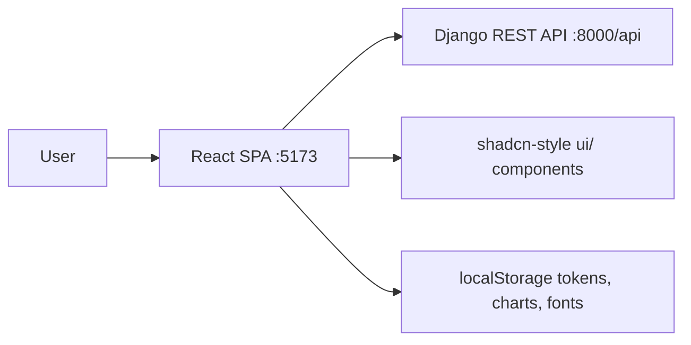

# Frontend Architecture and Design

| Field           | Value                                                                                     |
| --------------- | ----------------------------------------------------------------------------------------- |
| Audience        | Frontend developers, tech leads, reviewers, backend/API consumers                          |
| Scope           | Whole SPA (`frontend/src`) — the React client of the Personal Financial App               |
| Status          | Current                                                                                    |
| Last reviewed   | 2026-08-18                                                                                 |
| Source of truth | `frontend/src/**`, `vite.config.ts`, `frontend/package.json`, `docs/DOCUMENTATION.md`      |
| Stack focus     | React 19, TypeScript, Vite, Tailwind CSS, shadcn-style Radix UI, axios, Recharts/ApexCharts |

## Summary

The frontend is a single-page React application that talks to the Django REST API
(`/api/*`, proxied in dev). It owns no business logic: every page renders data from a
typed API module in `src/api/` and sends mutations back to the backend. The app is a
thin, auth-gated client shell (`src/layouts/FullLayout.tsx`) with feature components under
`src/components/` grouped by domain (analytics, statements, debts, goals, analysis, profile).

## Goals and Non-Goals

| Type     | Item                                                                                                  |
| -------- | ----------------------------------------------------------------------------------------------------- |
| Goal     | Keep the frontend a thin typed client; all parsing, AI, analytics and encryption live in Django        |
| Goal     | Transparent JWT session handling (silent refresh, queueing of concurrent 401s)                         |
| Goal     | Consistent shadcn-style UI primitives (`src/components/ui/`) with a dark-first theme                   |
| Non-goal | Offline-first behavior; any server state is refetched on demand                                        |
| Non-goal | Server-side rendering or static generation; this is a CSR SPA                                          |

## Current Architecture

### Context

- **Users**: authenticated users; every route below the login screens sits behind `ProtectedRoute`.
- **Backend API**: Django REST API at `/api` (see `docs/openapi.yaml`); JWT auth with silent refresh.
- **Design system**: local shadcn-style components (Radix primitives + `class-variance-authority`), Tailwind CSS 4 theming via CSS variables, dark theme by default (`main.tsx:13`).

### Building Blocks

| Component or layer        | Responsibility                                                          | Evidence                                        |
| ------------------------- | ----------------------------------------------------------------------- | ----------------------------------------------- |
| `src/main.tsx`            | App bootstrap: root render, global styles, `ThemeProvider` (dark default) | `frontend/src/main.tsx:11`                      |
| `src/App.tsx`             | Route table: public vs protected routes, layout nesting                 | `frontend/src/App.tsx:26`                       |
| `src/auth/`               | `AuthContext` (user state), token storage, route guards                 | `frontend/src/auth/AuthContext.tsx`, `ProtectedRoute.tsx` |
| `src/api/client.ts`       | Shared axios instance; Bearer injection; 401 queue + single-refresh     | `frontend/src/api/client.ts:33`                 |
| `src/api/*.ts`            | One typed module per backend resource (auth, statements, debts, goals, ai, profile) | `frontend/src/api/`                 |
| `src/layouts/FullLayout.tsx` | Authenticated shell: sidebar navigation, theme toggle, user menu        | `frontend/src/layouts/FullLayout.tsx`           |
| `src/components/ui/`      | Design-system primitives (button, card, dialog, table, select, …)       | `frontend/src/components/ui/button.tsx`         |
| `src/components/<domain>/` | Feature screens: analytics, statements, debts, goals, analysis, profile | `frontend/src/components/analytics/AnalyticsDashboard.tsx` |
| `src/lib/`                | Formatting/money helpers (`money.ts`), amortization math, misc utils    | `frontend/src/lib/money.ts`                      |
| `src/types/index.ts`      | Shared TypeScript types mirroring API payloads                          | `frontend/src/types/index.ts`                    |
| `src/css/`                | Global styles: reboot overrides, layouts (header/sidebar/container)     | `frontend/src/css/app.css`                       |

### Runtime and Data Flows

| Flow               | Steps                                                                                              | Evidence                        |
| ------------------ | -------------------------------------------------------------------------------------------------- | ------------------------------- |
| Session restore    | App mounts → `AuthContext` reads localStorage tokens → `GET /auth/me` validates → user state set   | `frontend/src/auth/AuthContext.tsx` |
| Authenticated call | Component calls `src/api/<domain>.ts` → axios attaches Bearer → Django answers                      | `frontend/src/api/client.ts:33`  |
| Token refresh      | 401 on non-auth call → one `POST /auth/refresh/` → queued requests replayed with the new token     | `frontend/src/api/client.ts:41`  |
| Logout             | `POST /auth/logout` (blacklists refresh) → tokens cleared → `auth:unauthorized` event handled      | `frontend/src/auth/AuthContext.tsx` |
| Statement upload   | `POST /statements/` (multipart PDF) → status polling via list endpoint → review screen              | `frontend/src/api/statements.ts`  |

## Contracts and State

| Contract or state object                                  | Purpose                                   | Owner            | Evidence                              |
| --------------------------------------------------------- | ------------------------------------------ | ---------------- | ------------------------------------- |
| `access_token` / `refresh_token` (localStorage)           | JWT session                                | `src/auth/tokenStorage.ts` | `frontend/src/auth/tokenStorage.ts` |
| `user` in `AuthContext`                                   | Current user profile                       | `src/auth/AuthContext.tsx` | `frontend/src/auth/AuthContext.tsx` |
| `VITE_API_URL` (env, default `/api`)                      | Base URL for all API calls                 | `src/api/client.ts` | `frontend/src/api/client.ts:13` |
| API types in `src/types/`                                 | Request/response shapes fed to UI          | `src/types/index.ts` | `frontend/src/types/index.ts` |
| `vite-ui-theme` (localStorage)                            | Persisted theme (dark default)             | `src/components/provider/theme-provider.tsx` | `frontend/src/main.tsx:13` |

## Cross-Cutting Concepts

| Concept                        | Current behavior                                                     | Evidence                                  | Gaps                       |
| ------------------------------ | -------------------------------------------------------------------- | ----------------------------------------- | -------------------------- |
| Routing and navigation         | Code-based routes in `App.tsx`; no router config file; full page loads on nav | `frontend/src/App.tsx:26` | None observed              |
| Vite/build/runtime             | React plugin, `src` alias, dev proxy `/api → :8000`; `tsc -b && vite build` | `frontend/vite.config.ts:6` | None observed              |
| Server state and data fetching | Raw axios per-resource modules; no TanStack Query; callers manage loading/error locally | `frontend/src/api/statements.ts` | Consider a query layer for cache/refetch unification |
| Client state                  | React context (`AuthContext`) + local component state; no global store | `frontend/src/auth/AuthContext.tsx` | None observed              |
| Design system and tokens      | Radix + CVA primitives; CSS-variable theming with dark first; Tailwind 4 | `frontend/src/components/ui/*`, `frontend/src/index.css` | None observed              |
| Accessibility and UI states   | Radix primitives provide keyboard/focus behavior; branded inputs, hover/focus rings | `frontend/src/components/ui/button.tsx` | Not audited via automated a11y checks |
| Testing and stories           | No component tests or Storybook in repo                                | `frontend/package.json`                  | No test suite for components |

## Decisions and Trade-Offs

| Decision                          | Rationale                                        | Consequence                                            | Evidence                              |
| --------------------------------- | ------------------------------------------------ | ------------------------------------------------------ | ------------------------------------- |
| Backend owns all business logic   | Parsing/AI/analytics stay testable in Django     | Frontend must round-trip for any computation           | `docs/DOCUMENTATION.md`               |
| Raw axios modules instead of TanStack Query | Initial simplicity, typed per-resource clients   | Duplicated loading/error handling; no cache invalidation strategy | `frontend/src/api/*.ts` |
| Dark-first themed UI              | Branded ledger aesthetic (`Ledgerline`)          | Accessibility of light mode is secondary               | `frontend/src/main.tsx:13`            |
| No UI test suite                  | Fast iteration in early stage                    | Refactor risk on shared primitives                     | `frontend/package.json`               |

## Risks and Open Questions

| Item                                        | Type   | Impact   | Owner   | Next step                                   |
| ------------------------------------------- | ------ | -------- | ------- | ------------------------------------------- |
| No automated frontend tests                 | Risk   | Medium   | Team    | Add Vitest + component tests for `ui/`      |
| No query caching layer                      | Risk   | Low      | Team    | Evaluate TanStack Query if data grows       |
| Single shared axios refresh queue           | Risk   | Low      | Team    | Keep in mind when adding multi-tab support  |

## Maintenance

Update this document when routes, API modules, design-system primitives, auth/session behavior, or build configuration change.